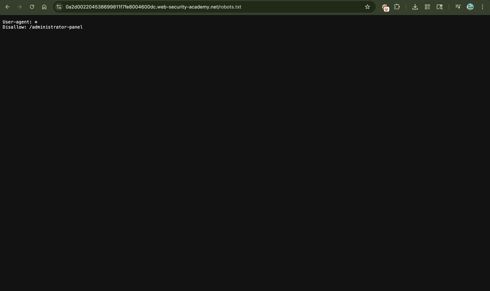
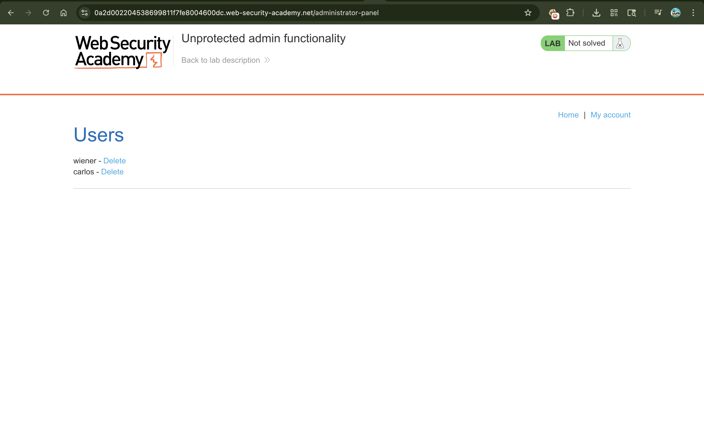
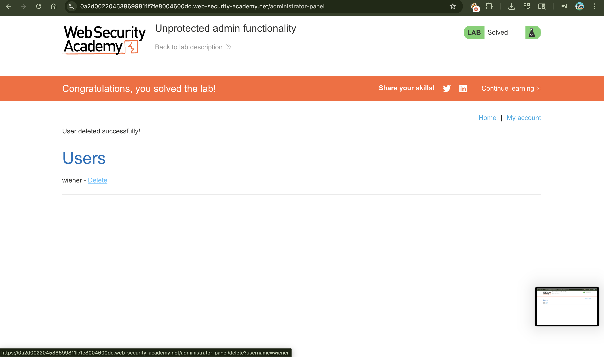

# Lab: Unprotected admin functionality

---

## 📌 Summary

The application exposes an unprotected admin panel that can be discovered through the `robots.txt` file.

An attacker can directly access the administrator interface without authentication and perform privileged actions such as deleting users.

---

## 🧾 Description

The vulnerability occurs because sensitive administrative functionality is publicly accessible without proper access control enforcement.

The `robots.txt` file unintentionally discloses the hidden admin panel path through the `Disallow` directive. Since the admin interface lacks authentication or authorization checks, any user can access it directly.

This allows unauthorized users to perform administrative actions.

---

## 🔁 Steps to Reproduce

1. Open the lab application  
2. Append `/robots.txt` to the URL  
3. Observe the `Disallow` entry revealing the admin panel path  
4. Replace `/robots.txt` with `/administrator-panel`  
5. Access the admin panel directly without authentication  
6. Delete the user `carlos`  

---

## 📸 Proof of Concept (PoC)

### 1. robots.txt Revealing Admin Path

### 2. Accessing the Unprotected Admin Panel

### 3. Deleting User Carlos

---

## 💥 Impact

This vulnerability allows unauthorized users to access sensitive administrative functionality.

As a result:
- Attackers can perform privileged administrative actions  
- User accounts can be modified or deleted  
- Sensitive application functionality becomes publicly accessible  
- The application’s access control mechanism is completely bypassed  

---

## 🛠️ Remediation

To fix this issue:

- Enforce proper authentication and authorization checks on all admin endpoints  
- Never rely on hidden URLs for security  
- Avoid exposing sensitive paths inside `robots.txt`  
- Restrict administrative functionality to authorized users only  

---

## 📚 Notes

This issue demonstrates a classic **Broken Access Control** vulnerability where administrative functionality is exposed without proper authorization enforcement.