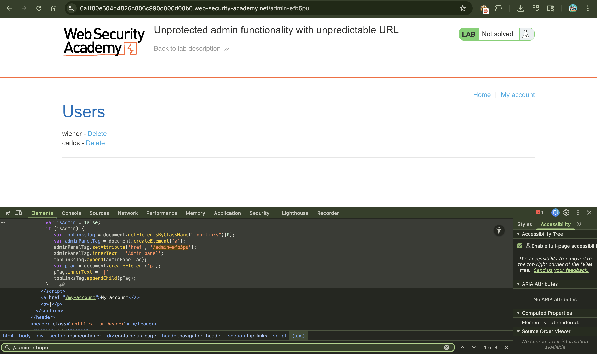
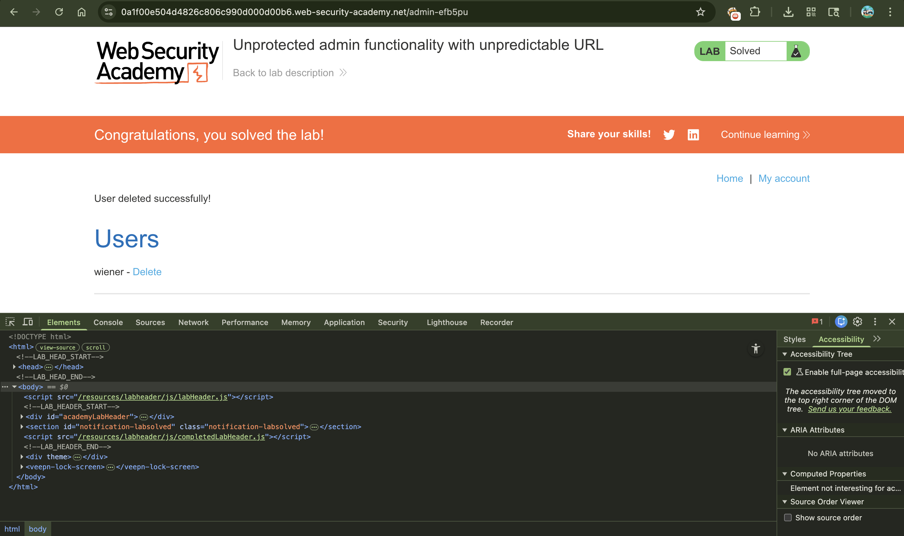

# Lab: Unprotected admin functionality with unpredictable URL

---

## 📌 Summary

The application contains an unprotected admin panel located at a hidden and unpredictable URL.

Although the admin path is not directly visible, it is exposed within the application's client-side JavaScript code, allowing attackers to discover and access the administrative interface without authentication.

---

## 🧾 Description

The vulnerability exists because sensitive administrative functionality is accessible without proper authorization checks.

The application attempts to hide the admin panel by using an unpredictable URL instead of enforcing access control. However, the hidden path is disclosed inside the page source through JavaScript code.

An attacker can inspect the source code, discover the admin endpoint, and directly access administrative functionality.

---

## 🔁 Steps to Reproduce

1. Open the lab application  
2. View the page source or intercept traffic using Burp Suite  
3. Inspect the JavaScript files loaded by the application  
4. Identify the hidden admin panel URL disclosed in the script ('/admin-efb5pu')
5. Navigate to the discovered admin endpoint  
6. Access the admin panel without authentication  
7. Delete the user `carlos`  

---

## 📸 Proof of Concept (PoC)

### 1. JavaScript Revealing Admin URL

### 3. Deleting User Carlos

---

## 💥 Impact

This vulnerability allows attackers to bypass intended security restrictions and gain unauthorized administrative access.

As a result:
- Administrative functionality becomes publicly accessible  
- Attackers can modify or delete user accounts  
- Sensitive application controls can be abused  
- Hidden URLs provide no real security without proper authorization checks  

---

## 🛠️ Remediation

To fix this issue:

- Enforce strict authentication and authorization checks on all admin endpoints  
- Never rely on hidden or unpredictable URLs for security  
- Avoid exposing sensitive routes in client-side JavaScript  
- Restrict administrative functionality to authorized users only  

---

## 📚 Notes

This issue demonstrates a **Broken Access Control** vulnerability where sensitive administrative functionality is exposed due to missing authorization enforcement and insecure reliance on hidden endpoints.