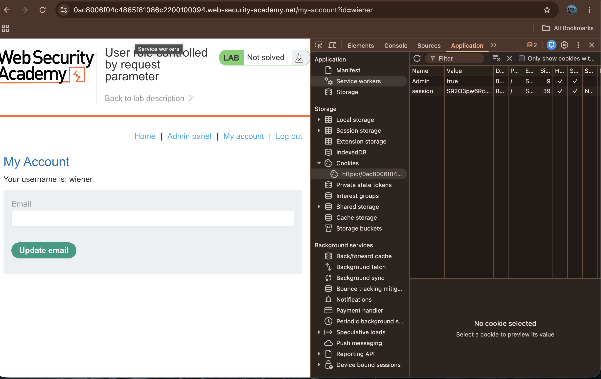
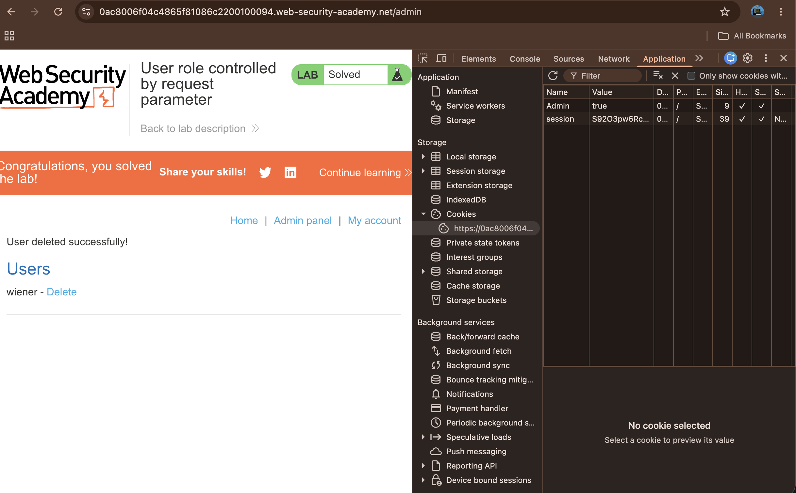

# User role controlled by request parameter

## Summary

The application is vulnerable to insecure access control. The admin panel is protected by a cookie that can be easily manipulated. By changing the `Admin` cookie value to `true`, an unauthorized user can gain administrative privileges and perform restricted actions, such as deleting users.

## Description

The application determines user roles based on a client-side cookie. Because the server does not properly validate whether the user should actually possess the "admin" role, it blindly trusts the `Admin` cookie value. An attacker can manually modify this cookie in the browser's developer tools to elevate their privileges.

## Steps to Reproduce

### 1. Log in to the Application

Access the lab and log in using the provided credentials: `wiener:peter`.

### 2. Modify Session Cookie

Open the browser's developer tools, navigate to the **Application** tab, and locate the cookies for the site. Locate the `Admin` cookie and change its value from `false` to `true`.

### 3. Access Admin Panel

Refresh the page. You will now see the "Admin panel" link appear in the navigation menu. Click it to access the administrative interface.

### 4. Delete User

Once inside the admin panel, identify the user "carlos" and click the Delete button to remove the account and solve the lab.

## Proof of Concept

1. Changing the Request Parameter to get Admin Access

2. Deleting Carlos User

## Impact

This vulnerability allows any authenticated user to gain full administrative access, leading to unauthorized account management and potential compromise of the entire user database.

## Remediation

* **Server-Side Validation**: Never rely on client-side cookies to determine a user's role. Always verify user permissions on the server side using a secure session management system.
* **Secure Access Control**: Ensure that administrative paths are only accessible to accounts explicitly authorized in the backend database.