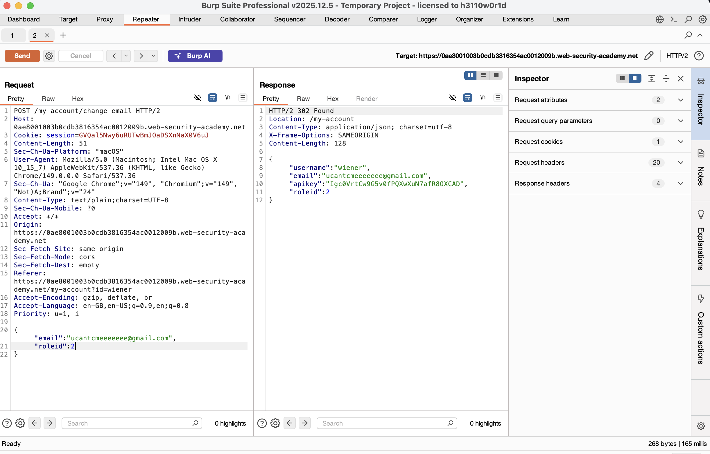
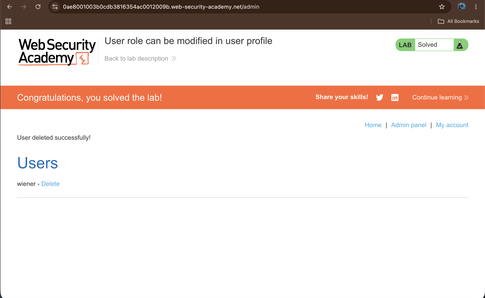

# User role can be modified in user profile

## Summary

The application is vulnerable to insecure access control via its profile update functionality. The admin panel is restricted to users with a specific role ID. By manipulating the JSON parameters in the profile update request to include a higher privilege `roleid`, an unauthorized user can elevate their privileges to an administrator and perform restricted actions, such as deleting users.

## Description

The application allows users to update their profile information, such as their email address, via a JSON request body. However, the server does not restrict which fields the client is allowed to modify. Because it blindly processes administrative fields like `roleid` passed from the client side, an attacker can append this parameter to their request to change their user role to an administrative level (`roleid: 2`).

## Steps to Reproduce

### 1. Log in to the Application

Access the lab and log in using the provided credentials: `wiener:peter`.

### 2. Capture the Profile Update Request

Navigate to the **My account** page. Fill in the email update form and submit a new email address. Capture this `POST /my-account/change-email` request using Burp Suite and send it to **Repeater**.

### 3. Elevate User Privileges

In Burp Suite Repeater, view the JSON body of the request. Append a comma after the email parameter and add the `"roleid": 2` parameter to the JSON object. Send the request. The server's response will echo back the profile details showing that your account's `roleid` has successfully been updated to `2`.

### 4. Access Admin Panel and Delete User

Navigate to `/admin` in your browser or click the newly visible **Admin panel** link. Find the user "carlos" within the user list and click the **Delete** link next to their name to remove the account and solve the lab.

## Proof of Concept

1. Modifying the JSON request body to change the user role ID to admin status

1. Successfully deleting the Carlos user from the administrative dashboard

## Impact

This vulnerability allows standard users to compromise the integrity of their authorization settings, leading to unauthorized privilege escalation. An attacker gaining administrative access can perform critical actions, access sensitive administration paths, and manage or delete other user profiles.

## Remediation

* **Server-Side Allowlisting**: When updating user profiles, enforce a strict allowlist of parameters that a user is permitted to modify. Do not automatically bind incoming JSON properties to the underlying user object on the server side.
* **Access Control Verification**: Ensure that any endpoint changing roles or administrative privileges requires robust, independent multi-factor verification or strict backend authorization logic that standard users cannot invoke.