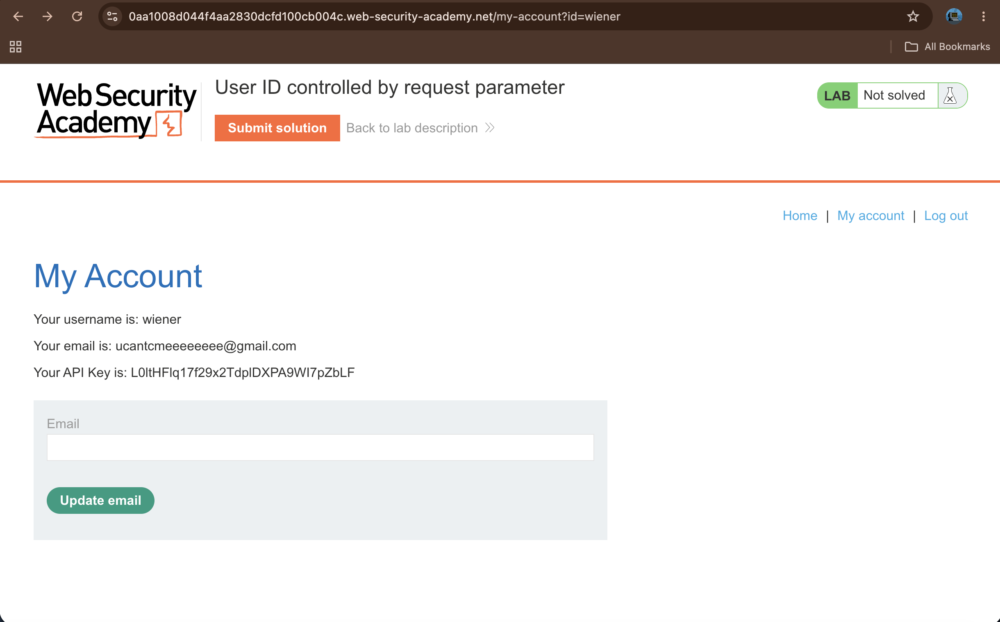
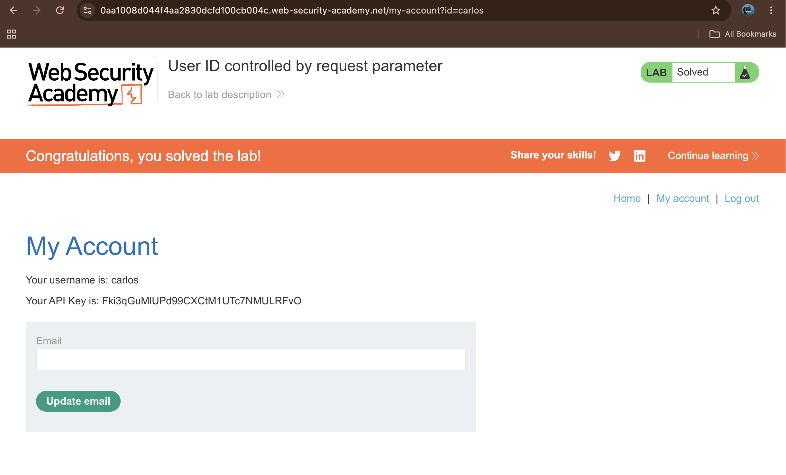

# User ID controlled by request parameter

## Summary

The application is vulnerable to horizontal privilege escalation via insecure direct object references (IDOR). The account dashboard relies entirely on an unvalidated query parameter to fetch user-specific data. By altering the `id` value in the URL request, any authenticated individual can view the account dashboard and sensitive credentials of another user profile.

## Description

The application implements access control based on client-supplied parameters inside the URL path. When a user navigates to their profile page, the site parses the `id` query parameter to determine which details to load. Because the server fails to cross-verify the requested identity parameter against the user's active session profile, it discloses restricted elements, such as unique account API tokens, to unauthorized parties.

## Steps to Reproduce

### 1. Log in to the Application

Access the lab interface and open the login screen. Authenticate using the standard target credentials provided: `wiener:peter`.

### 2. Inspect the Account URL Parameter

Navigate to the **My account** page using the main navigation menu. Examine the address bar of the browser and note that the URL appends a specific identity flag containing your active username: `?id=wiener`.

### 3. Modify the Request Parameter

Click directly into the browser's address bar or intercept the request using Burp Suite. Manually replace the parameter value `wiener` with the target username `carlos`, changing the string to `?id=carlos`, and resubmit the page request.

### 4. Extract Sensitive Data and Complete Lab

The application will process the modified query parameter and display the private account dashboard belonging to the target profile. Locate the disclosed string value listed next to the **Your API Key is:** label, copy the key value, and submit it through the lab interface banner to resolve the objective.

## Proof of Concept

1. Going to Vulnerable My Account Endpoint

2. Changing the ID URL parameter value from the authenticated session user to the target account profile

1. Solved the Lab

## Impact

This vulnerability permits authenticated users to execute horizontal privilege escalation across arbitrary profiles on the site. Compromising these parameters grants unauthorized exposure of restricted user records, potentially exposing session identifiers, personal data, or functional API access tokens that allow complete secondary account takeovers.

## Remediation

* **Server-Side Identity Evaluation**: Abandon user-controlled parameters for routing individual private profiles. Determine the target profile context strictly on the server side using securely stored, tamper-proof session data.
* **Access Control Mapping**: If application requirements dictate a variable parameter structure inside request queries, implement a strict validation matrix on the backend server to confirm the authenticated session token possesses explicit permission to view the requested resource.